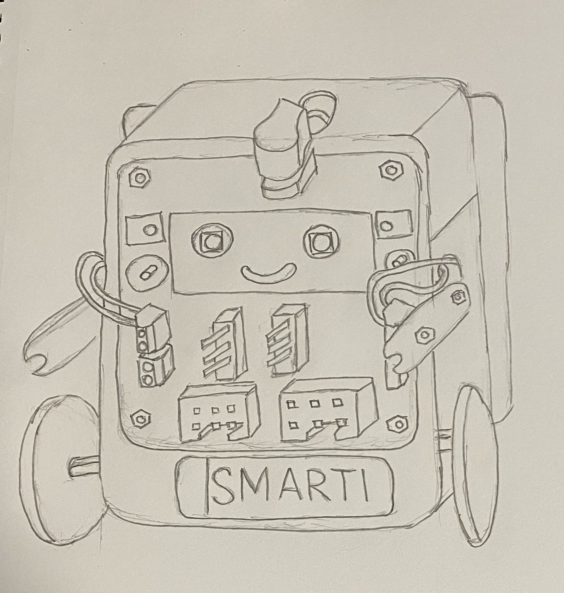
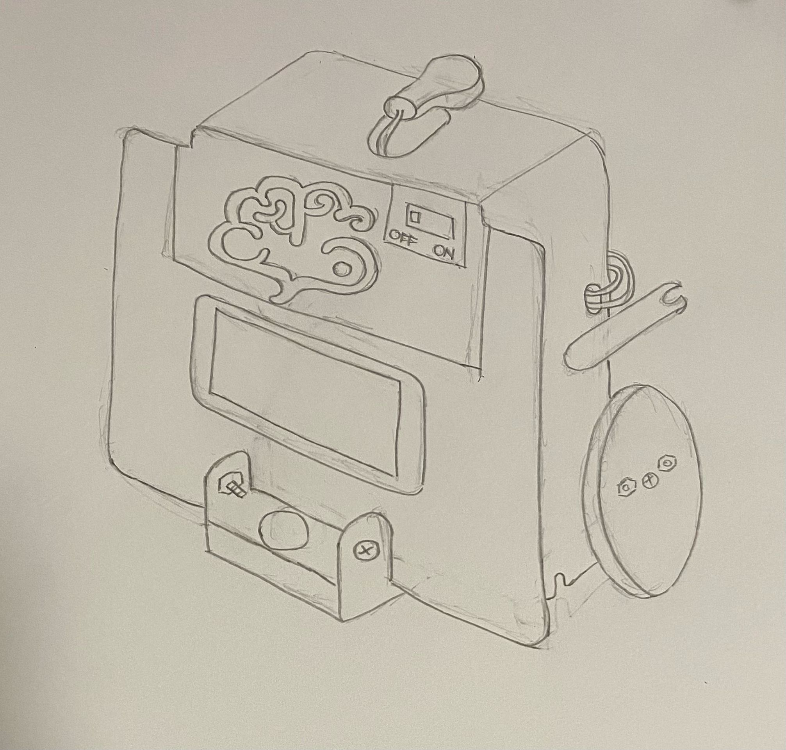
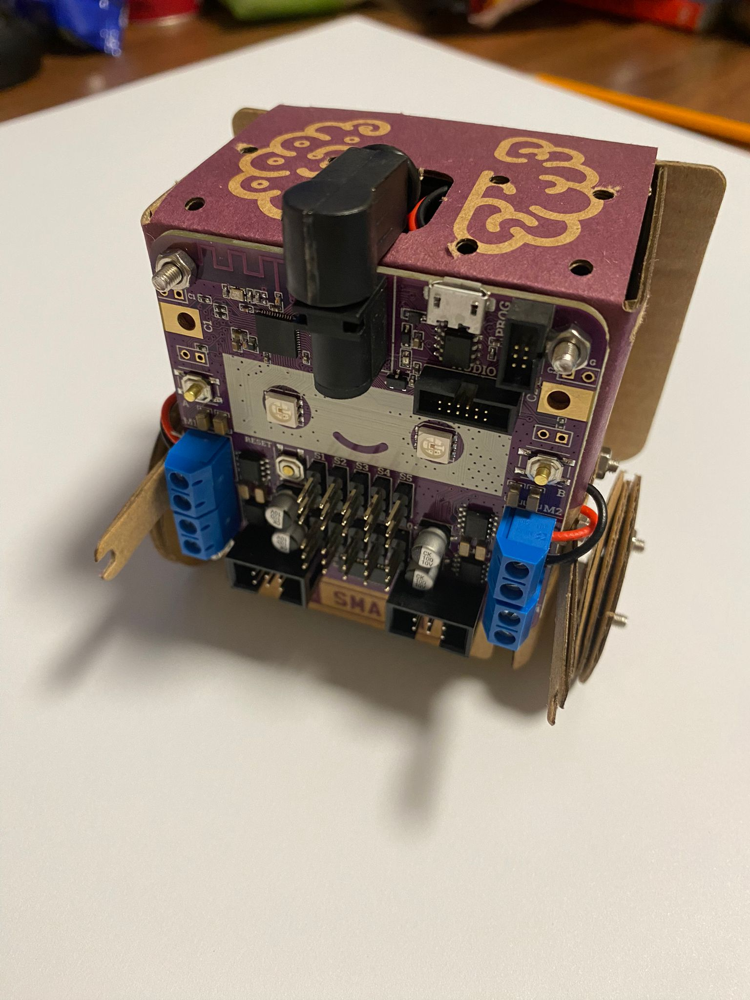
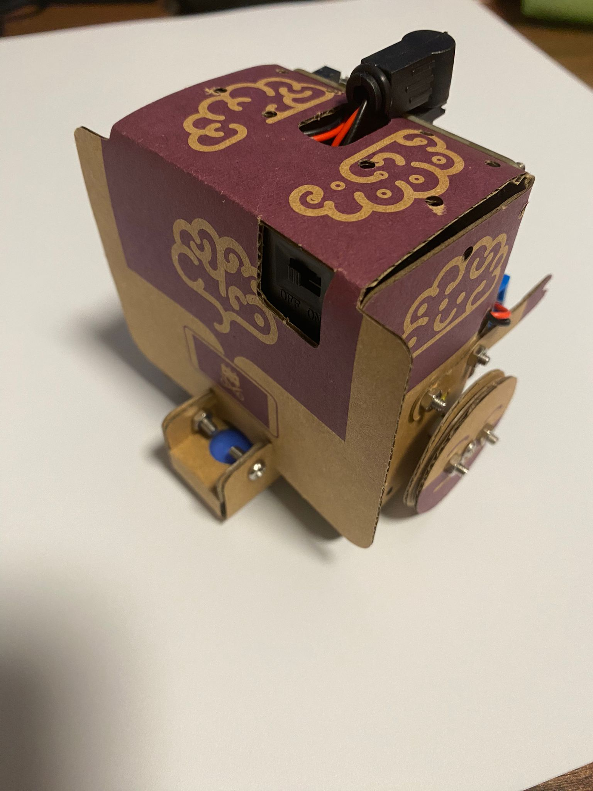

# Exploration

By utilizing Smartibot, we construct a robot using the provided design included in the package. This enables us to gain insight into the capabilities, advantages, and drawbacks of Smartibot. Through our exploration, we can identify methods to surpass the limitations of Smartibot.

## Sketches

We sketched this out to find out more about how we can incorporate certain design features of the smartibot into our prototype.

### Front

### Back

## Prototype

### Front

### Back

