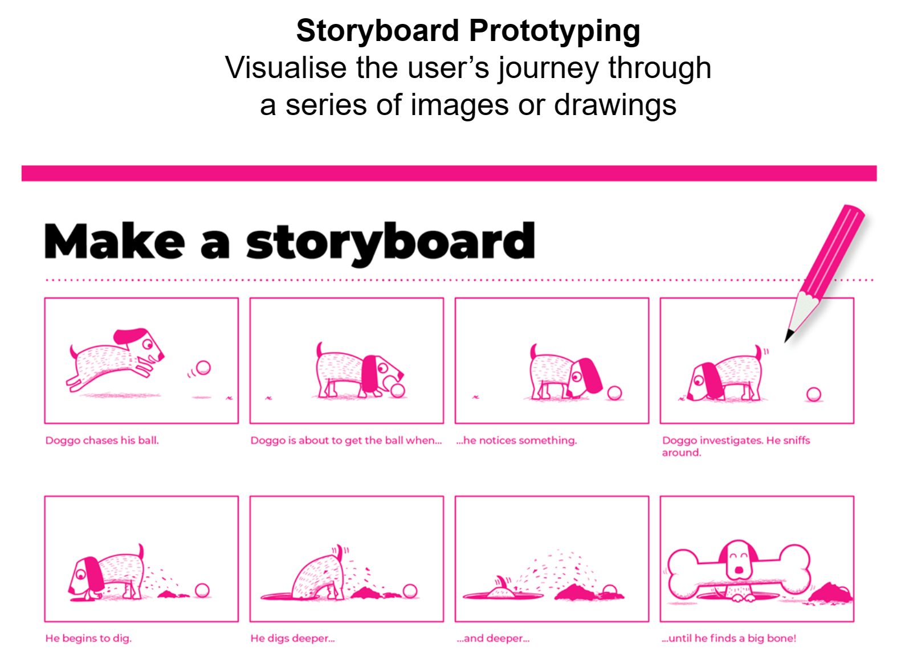
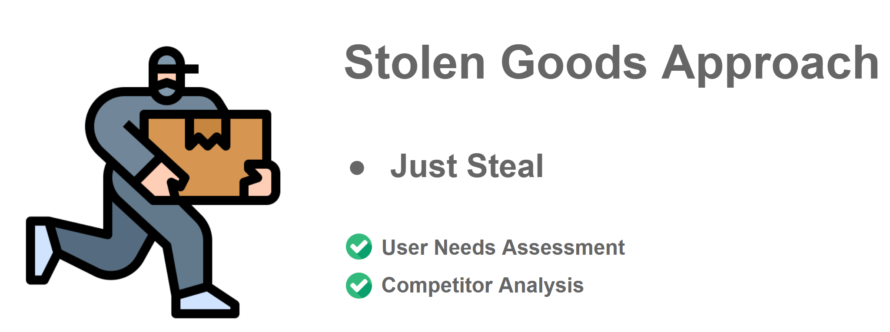

# Introduction

We will cover the  process of designing the robot car that solve the challenges faced in the problem statement.

## Specification

## Methodologies

The following are the design methodologies we will apply to our design process and  client collaboration.

### Storyboard

Storyboarding is a early prototyping techinque that helps designers to visualize and present the user experience in a series of sketches or images. It allows us to gather information on users, tasks, goals and to collaborate with others to generate new ideas. By drawing out the user's experience, we gain a better understanding of their perspective.

### Stolen Goods 

As the saying, "good designers copy, great designers steal". The idea behind this phrase is that while good designers may imitate or replicate existing designs, great designers take inspiration from existing designs and use it to create something new and unique.

We will conduct requirements gathering and competitors analysis to gain a deeper understanding of the problem they are trying to solve and the needs of their target audience. This can help us create a product that not only meets the needs of our client, but also stands out from the competition and provides a unique value proposition..
