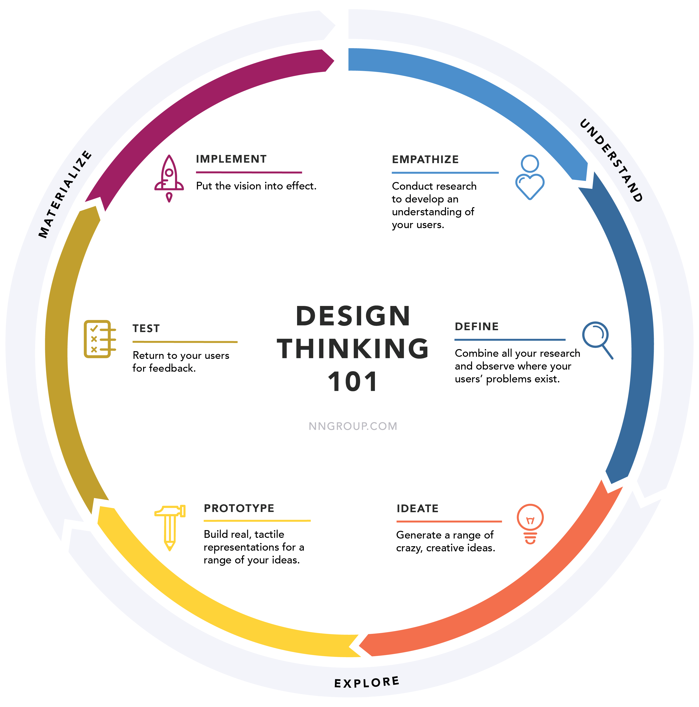

# Design Thinking

Design thinking is a problem-solving approach that involves empathizing with users, defining the problem, ideating potential solutions, prototyping those solutions, and testing them with users. Here's an overview of the design thinking process for prototyping:

1. Empathize: The first step in design thinking is to empathize with the users. This involves understanding their needs, wants, and pain points. Talk to your users, observe their behavior, and try to put yourself in their shoes.

2. Define: Based on your research and observations, define the problem you are trying to solve. This step involves synthesizing the data you gathered in the empathize stage and creating a problem statement.

3. Ideate: Brainstorm ideas for potential solutions. Encourage creativity and generate as many ideas as possible, without judging them. Think outside the box and consider both obvious and unconventional solutions.

4. Prototype: Select the best ideas from the ideation stage and create prototypes. A prototype is a rough draft or simulation of your solution. It can be a physical model, a sketch, a wireframe, or a digital mockup.

5. Test: Test your prototype with users to get feedback on its functionality and usability. Observe how users interact with your prototype and ask for their feedback. Use this feedback to refine your prototype and iterate on your solution.

6. Iterate: Use the feedback you received from testing to refine your prototypes and improve your solution. Repeat the prototyping and testing process until you have a solution that meets the needs of your users.
