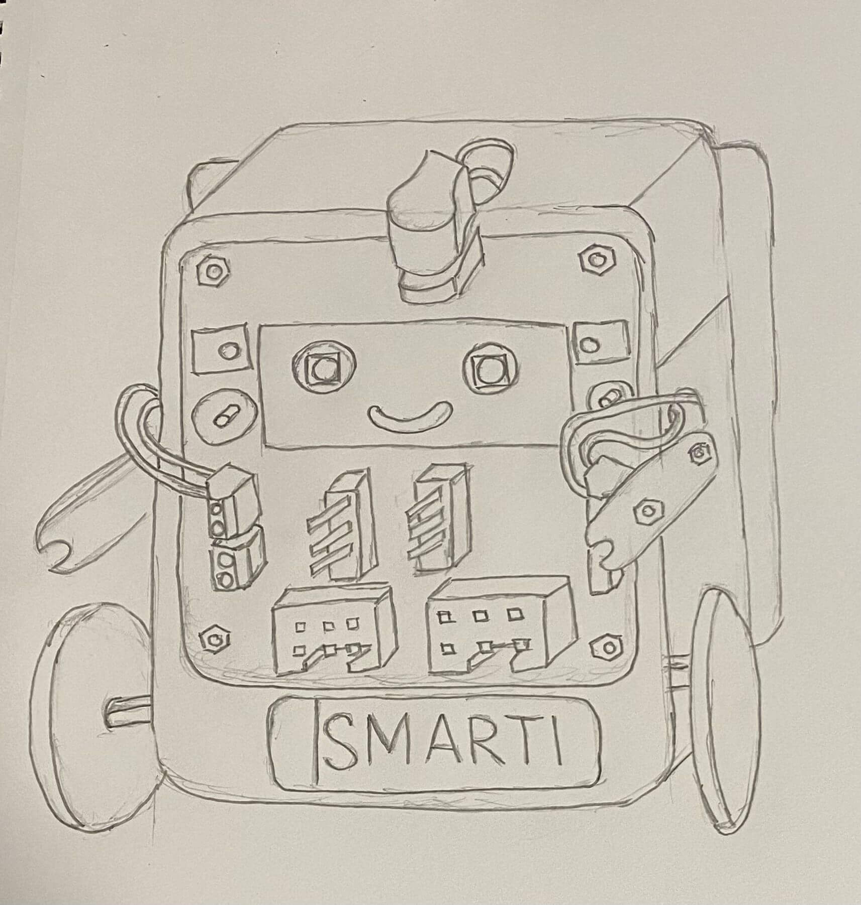

# Stolen Goods

As the saying, "good designers copy, great designers steal". The idea behind this phrase is that while good designers may imitate or replicate existing designs, great designers take inspiration from existing designs and use it to create something new and unique.

We will conduct requirements gathering and competitors analysis to gain a deeper understanding of the problem they are trying to solve and the needs of their target audience. This can help us create a product that not only meets the needs of our client, but also stands out from the competition and provides a unique value proposition..

## Smartibot

[Smartibot](https://thecraftyrobot.net/) is a robot kit that works with your smartphone. It uses a powerful AI to recognize objects it sees, like pets, people, and vehicles, and respond to them. You can also drive Smartibot yourself. The parts from the kit can be reused to make robots out of anything.

### Exploration

By utilizing Smartibot, we construct a robot using the provided design included in the package. This enables us to gain insight into the capabilities, advantages, and drawbacks of Smartibot. Through our exploration, we can identify methods to surpass the limitations of Smartibot.

### Sketches

We sketched this out to find out more about how we can incorporate certain design features of the smartibot into our prototype.

The main concerns of users is whether they can  easily identifying front/back, and the speed of the robot. Smartibot can provide a face to show that it’s the front and it uses a different motor from the curio which makes it faster, addressing the existing concerns faced by users. 

#### Front

#### Back

### Prototype

We build the smartibot with the materials provided for us.

#### Front

#### Back

### Learning points

Curio and Smartibot are both great options for users are interested in robotics. Curio is a good choice for users are **just starting out**, as it is has a much simpler design and is durable. Smartibot is a good choice for those that are **more experienced** with robotics, as it is more versatile and has more features.

|  | **Strengths** | **Weaknesses** |
|---|---|---|
| **Curio** | - Simple design - Durable - Light battery | - Limited customization - Not as many features as Smartibot - Lacking instructions on main website |
| **Smartibot** | - Versatile - Lots of features - Easy to customize - Engaging and educational | - Greater complexity - Not as durable depending on the material use - Heavier battery |

We could "steal" some of smartibot strengths by adding more features and making curio customize.
