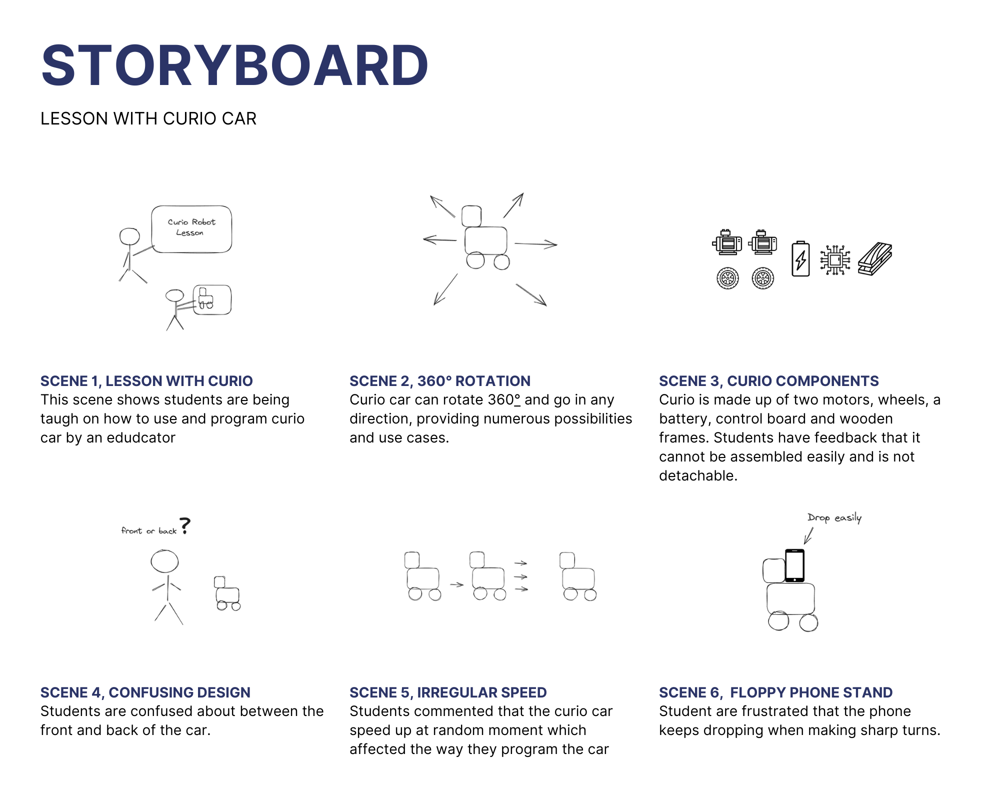

# Storyboard

Storyboarding is a early prototyping techinque that helps designers to visualize and present the user experience in a series of sketches or images.

The storyboard above illustrates a scenario where an instructor is using Curio to teach a class about robotics. Through the storyboard, the features and limitations of Curio are showcased, which are based on the feedback received from users. Storyboards are an effective tool for visualizing user experiences, and in this case, they help to provide a better understanding of the user experience with Curio.
